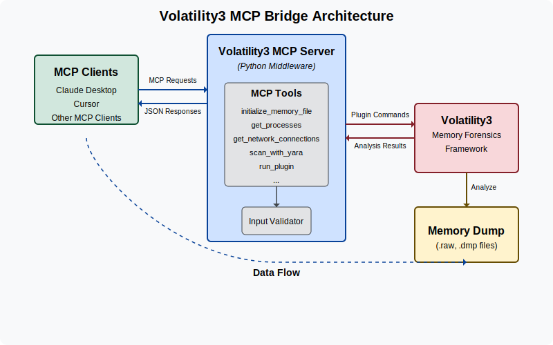
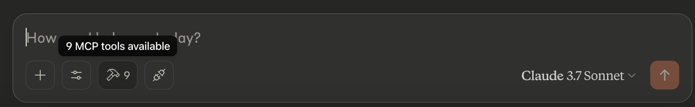
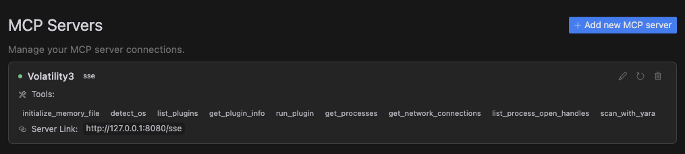

# Volatility3 MCP Server

## Introduction
Volatility3 MCP Server is a powerful tool that connects MCP clients like Claude Desktop with Volatility3, the advanced memory forensics framework. This integration allows LLMs to analyze memory dumps, detect malware, and perform sophisticated memory forensics tasks through a simple, conversational interface.


## Demo
[Demo Video](https://1drv.ms/v/c/b3eb1096e4f4a3a8/EfKIAsM9zUpGtXjJMDn0zywB-R3UnwvYD4yX71q1CinfRw?e=lke0Ox)

You can also find a [detailed presentation](./attachments/project-presentation.pdf) on this tool here.

## What This Solves
Memory forensics is a complex field that typically requires specialized knowledge and command-line expertise. This project bridges that gap by:
- Allowing non-experts to perform memory forensics through natural language
- Enabling LLMs to directly analyze memory dumps and provide insights
- Automating common forensic workflows that would normally require multiple manual steps
- Making memory forensics more accessible and user-friendly

## Features
- **Memory Dump Analysis**: Analyze Windows and Linux memory dumps using various plugins
- **Process Inspection**: List running processes, examine their details, and identify suspicious activity
- **Network Analysis**: Examine network connections to detect command and control servers
- **Cross-Platform Support**: Works with both Windows and Linux memory dumps (macOS support coming soon)
- **Malware Detection**: Scan memory with **YARA rules** to identify known malware signatures

## Configuration

1. Clone this repository:
2. Create a virtual environment:
   ```bash
   python -m venv environ
   source environ/bin/activate
   ```
3. Install the required dependencies:
   ```bash
   pip install -r requirements.txt
   ```

You can use this project in two ways:

### Option 1: With Claude Desktop
4. Configure Claude Desktop:
   - Go to `Claude` -> `Settings` -> `Developer` -> `Edit Config` -> `claude_desktop_config.json` and add the following
     ```json
        {
            "mcpServers": {
            "volatility3": {
                "command": "absolute/path/to/virtual/environment/bin/python3",
                "args": [
                "absolute/path/to/bridge_mcp_volatility.py"
                ]
            }
            }
        }
     ```
        
5. Restart Claude Desktop and begin analyzing the memory dumps.

### Option 2: With Cursor (SSE Server)
4. Start the SSE server:
   ```bash
   python3 start_sse_server.py
   ```
4. Configure Cursor to use the SSE server:
   - Open Cursor settings
   - Navigate to `Features` -> `MCP Servers`
   - Add a new MCP server with the URL `http://127.0.0.1:8080/sse`

6. Use the Cursor Composer in agent mode and begin analyzing memory dumps.

## Available Tools

- **initialize_memory_file**: Set up a memory dump file for analysis
- **detect_os**: Identify the operating system of the memory dump
- **list_plugins**: Display all available Volatility3 plugins
- **get_plugin_info**: Get detailed information about a specific plugin
- **run_plugin**: Execute any Volatility3 plugin with custom arguments
- **get_processes**: List all running processes in the memory dump
- **get_network_connections**: View all network connections from the system
- **list_process_open_handles**: Examine files and resources accessed by a process
- **scan_with_yara**: Scan memory for malicious patterns using YARA rules

## Contributing
Contributions are welcome! Please feel free to submit a Pull Request.
